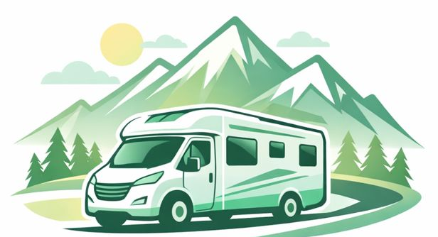

<p align="center">
  
</p>
<p align="center">
  
</p>


Projet pour le BTS développeur Web et Web mobile

## 📋 Sommaire
- [À propos](#-à-propos)
- [Fonctionnalités](#-fonctionnalités)
- [Technologies utilisées](#-technologies-utilisées)
- [Installation](#-installation)
- [Utilisation](#-utilisation)
- [Auteurs](#-auteurs)

---

## 🧐 À propos
"Ce projet est une application web permettant à des utilisateurs de vendre en ligne 
des accéssoires pour camping car"*

## ✨ Fonctionnalités
- ✅ Inscription et connexion sécurisée
- 📊 Tableau de bord interactif
- 📱 Design responsive (mobile & desktop)
- 🌙 Mode sombre automatique

## 🛠 Technologies utilisées
* **Frontend :** HTML, CSS
* **Backend :** Node.js, Express
* **Base de données :** mysql

## ⚙️ Installation

Pour faire tourner le projet localement :

1. **Cloner le dépôt**
   ```bash
   git clone [https://github.com/ton-pseudo/ton-repo.git](https://github.com/ton-pseudo/ton-repo.git)
